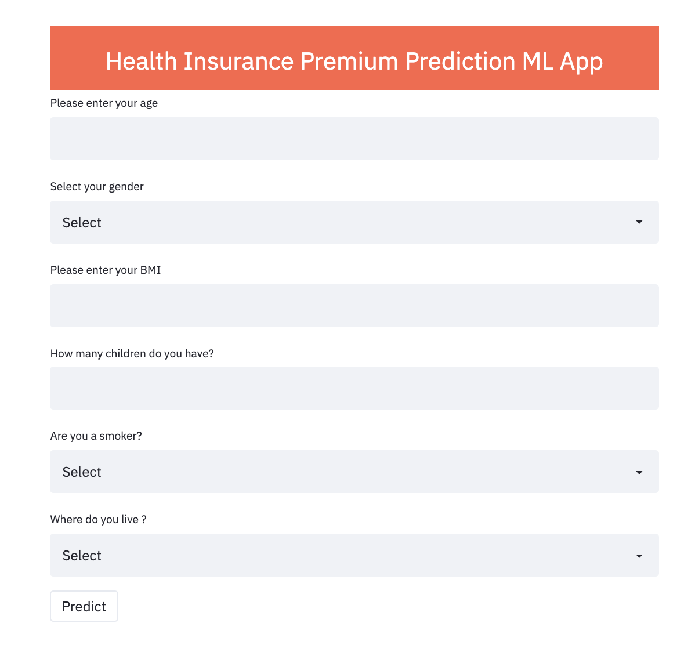

# Health Insurance Prediction ML app
App Link: https://health-insurance-premium-predi.herokuapp.com/

Goal: To Help People Compare and Choose the Right Health Plan with the Premium

The healthcare premiums keep changing every year because of various factors such as medical trends, pharmaceutical trends, and political factors etc. over which the customer has no control, We need to Educate people on Health plans, For example, just by eliminating smoking and lowering the BMI by a few points might mean saving thousands of dollars from premium charges

